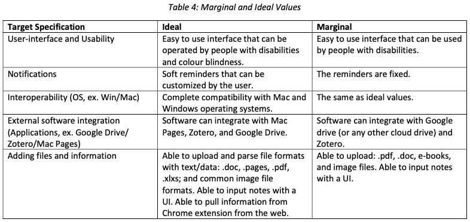

# GNG2101 B31 - Annota

:mortar_board: :pencil2: :beginner: :memo: :bookmark: :pushpin: :paperclip: :low_brightness: :mortar_board: :pencil2: :beginner: :memo: :bookmark: :pushpin: :paperclip: :low_brightness: :mortar_board: :pencil2: :beginner: :memo: :bookmark: :pushpin: :paperclip: :low_brightness:
:mortar_board: :pencil2: :beginner: :memo: :bookmark: :pushpin: :paperclip:


## Introduction

A discourse analysis, the study of written or spoken language in relation to its social context, requires taking notes and putting annotations in documents and images to be able to analyze the data. The client for this project, a second year Masters student with a disability and chronic illness, is seeking to perform a discourse analysis of a government bill for her research, but she is not always capable of remembering the documents and what ties the have to other pieces of information. The purpose of this project is to create a way for her to keep a visual timeline of all the annotated and reviewed documents and how the information might flow from one to another.


## Highlighted features (Deliverable B Final Specs :revolving_hearts:)




## Testing and running

**Basic** start option: run the Flask app from a Python virtual environment

```{bash}
  cd gng2101-proj                   # Navigate to folder
  python3 -m venv env               # Make virtual environment
  source env/bin/activate           # Start virtual environment
  pip install -r requirements.txt   # Install Python requirements into virtual env
  python app.py                     # Run the app

```

**If you have an env already** start option: run app

```{bash}
  source env/bin/activate
  python app.py

```

**Big Hammer** start option: no virtual environment, just run the app and install all packages locally

```{bash}
  cd gng2101-proj                   # Navigate to folder
  cd app                            # Navigate to app folder
  python app.py                     # Run the app and just install everything it errors out on

```

:exclamation: If you import any libraries/install anything in the virtual environment and want to capture its state so the next user can have the same settings, use:

```{bash}
  python -m pip freeze > requirements.txt

```

To deactivate virtual environment after you are done:

```{bash}
  deactivate
```


With slight variations between different workspaces, ex. Windows/Linux command line script may differ slightly. After you see similar text to the below:

```{bash}
  (env) (base) Kurama:app diqiao$ python app.py
 * Serving Flask app "app" (lazy loading)
 * Environment: production
   WARNING: This is a development server. Do not use it in a production deployment.
   Use a production WSGI server instead.
 * Debug mode: on
 * Running on http://127.0.0.1:5000/ (Press CTRL+C to quit)
 * Restarting with stat
 * Debugger is active!

```

Go to `localhost:5000` in your browser to view the app. 


## Git quick-start

### Useful links:

- [GitHub Guides (~10 minute reads)](https://guides.github.com)
- [StackExchange answer on how to keep your local branch updated](https://superuser.com/questions/224085/git-merge-master-into-a-branch)
- [GitHub Desktop, for people who really hate the command prompt](https://desktop.github.com)
- [Pull Request](https://www.boldgrid.com/support/wordpress-tutorials/how-to-create-a-pull-request-on-a-github-repository/)
- [GitHub Cheatsheet from SEG2105](github-info/github-git-cheat-sheet.pdf)
- [Mana's GitHub Cheatsheet](git-cheat-sheet-education.pdf)

- [Branching with GitHub](https://gist.github.com/blackfalcon/8428401)
- [Google Chrome Extention Docs](https://developer.chrome.com/extensions/getstarted)

### Bread-and-butter workflow (? not sure if useful):

1. Jack and Jill wants to work on a project together in GitHub.
1. They clone the master repo to their local machines.
1. They split up the work so that they don't work on the same files at the same time (otherwise it's a nightmare when merging).
1. Jack is assigned to a task, for which there is an issue card in the project Kanban.
1. Jack makes a personal branch to do work on: jack/sprint_1_html.
1. Jack does work on his personal branch, adds and commits, and pushes his branch to github.
1. Jack then goes to GitHub website and makes a pull request, assigns himself, assigns Jill to review, and links PR with project issue.
1. Jill reviews, approves and merges Jack's PR; or reject/edit the code.
1. Once merged/resolved, Jack visits the project Kanban to make sure the issue card is in the correct swim lane.
1. Rinse and repeat with small variations (if all goes well).

### Basic shell scripts:

1. `git clone {repo link}` Repository link.
1. `git status` To check the status of your git.
1. `git checkout -b {student name/branch name}` Please follow this format when creating branches.
1. Make your changes. :shipit:
1. `git add .` or `git add -A` Dot adds all files, whereas -A adds all changes including deletions (choose your own adventure). `git add {filename}` Adds specific files.
1. `git commit -m` Followed with descriptive commit message in quotation marks, ex. `git commit -m "jodi changed default font"`.
1. `git pull origin {branch name}` Pull often to stay updated.

:exclamation: **For files such as .DS_Store, feel free to add it to .gitignore so we don't include every random thing in the project repo. Alternatively, add and commit specific filenames.**


## Contacts

- Rikki R.
- Philippe G.
- Daanish K.
- Bjorn V.
- Jodi Q.


## Misc

[GitHub Markdown Emojis](https://gist.github.com/rxaviers/7360908) :bowtie:

[Markdown Cheatsheet](https://github.com/adam-p/markdown-here/wiki/Markdown-Cheatsheet#code)

